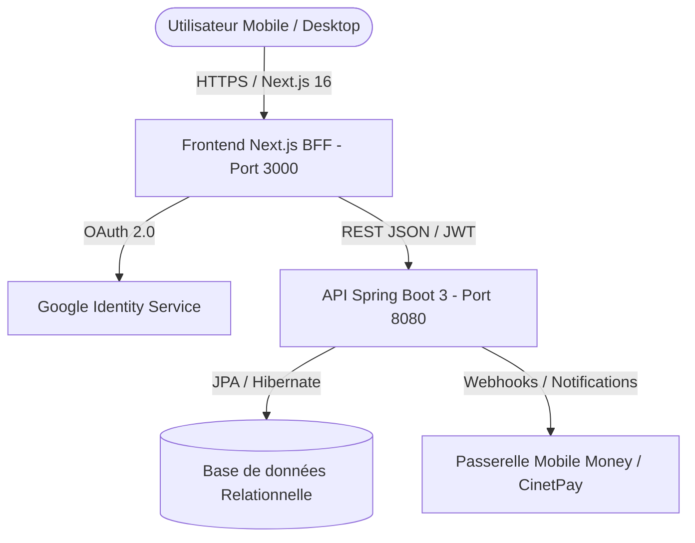

# 🏀 FasoHoops.BF — Master Roadmap, Architecture & Spécifications Métier

> **Plateforme Nationale de Digitalisation, Détection et Recrutement du Basketball Burkinabè**  
> *En partenariat et conformité avec la Fédération Burkinabè de Basketball (FEBBA) et le Ministère des Sports.*

---

## 1. 📋 Résumé Exécutif du Projet

**FasoHoops.BF** est la première plateforme technologique institutionnelle et sportive unifiée du Burkina Faso dédiée au basketball. Elle connecte l'ensemble de l'écosystème :
1. **Les Joueurs & Joueuses** (U15, U18, U20, Senior LNBB, Espoirs) en leur offrant un passeport numérique officiel, un portfolio certifié (vidéos, mensurations, performances FIBA) et un canal direct de recrutement.
2. **Les Clubs & Académies** (AS Douanes, USFA, Étoile Filante, etc.) pour la structuration de leurs catégories, la gestion des effectifs (rosters) et la publication d'appels à détection.
3. **Les Entraîneurs & Coaches Techniques** pour la planification des entraînements, le suivi individuel et la conduite de camps régionaux.
4. **Les Agents Sportifs FIBA** pour la détection, la gestion de mandats et l'ouverture d'opportunités professionnelles (BAL, championnats d'Afrique et d'Europe).
5. **La FEBBA & Les Institutions** pour la supervision fédérale, la validation des licences sportives, l'homologation des clubs et la protection légale des mineurs.

---

## 2. 🚀 État Actuel du Projet (Accompli & Fonctionnel)

### ✅ Authentification, Profils & Multi-Rôles
- **Gestion stricte des 5 rôles** : `JOUEUR`, `CLUB`, `ENTRAINEUR`, `AGENT`, `ADMIN` (FEBBA).
- **Connexion hybride** : Credentials (Email / Mot de passe avec chiffrement BCrypt) et Google OAuth 2.0.
- **Synchronisation automatique des rôles** : Pont bidirectionnel entre NextAuth et Spring Boot garantissant que chaque utilisateur accède à son profil réel et son espace dédié sans rétrogradation arbitraire.
- **Redirection intelligente** :
  - `ADMIN` → Espace Gouvernance & Validations Fédérales (`/admin/validations`).
  - `CLUB` → Espace Club & Équipes (`/club/dashboard` et `/club/equipes`).
  - `JOUEUR` / `ENTRAINEUR` / `AGENT` → Dashboard personnel interactif (`/dashboard`).

### ✅ Messagerie Complète avec Sélecteur de Contacts
- **Annuaire des membres interactif** : Possibilité de cliquer sur « Nouveau message » et de choisir n'importe quel contact certifié (Club, Joueur, Coach, Agent, FEBBA) filtré par rôle et recherche dynamique.
- **Gestion des fils de discussion** : Affichage temps réel des messages avec horodatage, statut de lecture et transmission sécurisée.
- **Support de liens directs** : Paramètre d'URL `?contactId=...` permettant de lancer une discussion instantanée depuis une fiche de profil.

### ✅ Système de Paiement Réel Mobile Money Burkinabè
- **Passerelle multi-opérateurs** : Orange Money Burkina, Moov Money Africa, LigdiCash et Cartes Bancaires.
- **Validation télécom** : Format de numéro de téléphone burkinabè à 8 chiffres (+226 70/71/75/76/60...).
- **Processus transactionnel authentique** :
  1. Étape 1 : Saisie et choix du moyen de paiement.
  2. Étape 2 : Autorisation Mobile Money USSD Push (`*144*4*6#` pour Orange Money, `*555*6#` pour Moov Money) et saisie du code OTP de confirmation.
  3. Étape 3 : Émission d'un **Reçu Officiel** de transaction (avec identifiant unique `TX-FH-...`, montant en FCFA, agrément FEBBA, date et bouton d'impression).
- **Activation immédiate des abonnements** : Mise à jour du badge Pro / Élite et déblocage des fonctionnalités premium.

### ✅ Refonte Visuelle de la Page Profil
- **Résolution du bug graphique** : Suppression du chevauchement de la bannière sombre sur le texte du nom.
- **Nouveau design athlétique** : Bannière dynamique de terrain de basket haute résolution, avatar avec bague de contraste, typographie ultra-nette en light et dark mode.
- **Affichage enrichi** : Mensurations officielles (Taille, Poids, Envergure), statut de licence FEBBA, bio sportive, vidéo highlights YouTube et galerie photo de match.

### ✅ Gestion Interactive du Roster (Profil Club)
- **Modal de gestion d'équipe complet** :
  - Visualisation des joueurs par équipe (numéro de maillot, poste, statut Titulaire / Remplaçant, numéro de licence).
  - Formulaire d'ajout rapide d'un joueur avec recalcul automatique de l'effectif (`effectif: N joueurs`).
  - Bascule interactive de statut (Titulaire ⟳ Remplaçant) d'un simple clic.
  - Retrait d'un joueur avec synchronisation locale et persistance.

### ✅ Tableaux de Bord Enrichis pour Tous les Rôles
- **Indicateurs de flux dynamiques** : Valeurs initialisées à `0` lorsqu'il n'y a pas encore d'activité, avec labels explicatifs et dynamisation selon les interactions.
- **Espaces dédiés** :
  - **Joueur** : Progression du profil (85%), candidatures envoyées, offres recommandées, détections à venir.
  - **Entraîneur** : Séances planifiées, joueurs suivis, fiches tactiques, stages régionaux.
  - **Agent** : Portefeuille d'athlètes sous contrat, mandats, opportunités BAL / internationales.
  - **Club** : Effectifs totaux, publication d'offres, demandes de licences globales.
  - **Admin FEBBA** : Homologations de clubs, validation des licences en attente, alertes fédérales.

---

## 3. 📂 Structure Globale du Projet

```text
Fasohoops.app/
├── ROADMAP.md                  # Documentation master & feuille de route
├── .gitignore                  # Exclusion des dépendances et bases locales
│
├── frontend/                   # Application Web Frontend (Next.js 16 App Router)
│   ├── src/
│   │   ├── app/                # Routes et Pages de l'application
│   │   │   ├── abonnements/    # Tarification & Paiement Mobile Money
│   │   │   ├── admin/          # Espace gouvernance FEBBA (Validations, Licences)
│   │   │   ├── club/           # Espace club (Dashboard & Gestion Rosters)
│   │   │   ├── connexion/      # Page de connexion
│   │   │   ├── dashboard/      # Tableaux de bord multi-rôles enrichis
│   │   │   ├── inscription/    # Entonnoir d'inscription en 3 étapes
│   │   │   ├── joueurs/        # Annuaire public des talents
│   │   │   ├── messages/       # Messagerie temps réel avec sélecteur de contact
│   │   │   ├── profil/         # Fiche profil joueur / encadrant
│   │   │   ├── recrutement/    # Bourse aux offres de recrutement
│   │   │   ├── statistiques/   # Statistiques officielles des championnats
│   │   │   ├── api/auth/       # Handlers NextAuth & Synchronisation Spring Boot
│   │   │   └── globals.css     # Design System TailwindCSS v4
│   │   ├── components/         # Navbar, Footer, Modals réutilisables
│   │   └── lib/                # Client API Spring Boot, Permissions, Prisma
│   ├── package.json            # Dépendances Node.js / pnpm
│   └── tsconfig.json           # Configuration TypeScript stricte
│
└── backend/                    # Microservice API REST (Java 17 / Spring Boot 3)
    ├── pom.xml                 # Dépendances Maven (Spring Security, JPA, H2)
    └── src/main/java/bf/fasohoops/api/
        ├── config/             # Configuration Sécurité, JWT, Initialisation
        ├── controller/         # Contrôleurs REST (Auth, Messages, Clubs, Joueurs, Paiement)
        ├── entity/             # Modèle relationnel JPA (AbstractUser, Joueur, Club, Admin...)
        ├── repository/         # Interfaces Spring Data JPA
        ├── security/           # Filtres JWT & Gestionnaire d'authentification
        └── services/           # Logique métier & Intégration CinetPay / Mobile Money
```

---

## 4. 💻 Langages & Stack Technologique

| Couche | Technologie | Rôle & Justification |
|---|---|---|
| **Frontend Framework** | **Next.js 16 (React 19)** | Rendu hybride SSR/CSR, App Router, performances optimales et SEO |
| **Typage & Rigueur** | **TypeScript 5** | Typage statique strict garantissant zéro erreur d'exécution |
| **Styling & Design** | **TailwindCSS 4** | Design system sur mesure, responsive mobile-first, Dark/Light mode |
| **Backend Framework** | **Spring Boot 3 (Java 17)** | Architecture d'entreprise robuste, sécurité Spring Security et multithreading |
| **Persistance de Données** | **JPA / Hibernate + H2 / PostgreSQL** | Modélisation objet-relationnel avec héritage JOINED pour les profils |
| **ORM Frontend** | **Prisma (LibSQL / SQLite)** | Cache local et compatibilité d'authentification NextAuth |
| **Authentification** | **NextAuth.js v4 + JWT Spring Security** | Double signature sécurisée (Sessions stateless côté microservice) |
| **Télécoms & Paiements** | **Orange Money, Moov Money, LigdiCash** | Écosystème Mobile Money natif burkinabè |

---

## 5. ⚖️ Logique Métier & Cadre Réglementaire Burkinabè

### A. Protection des Mineurs (Loi n° 001-2021/AN)
- FasoHoops applique une politique stricte de **protection des données des jeunes athlètes de moins de 18 ans**.
- Les coordonnées personnelles (téléphone, email privé) d'un joueur mineur sont automatiquement masquées (`*****@mineur-protege.bf`) pour les utilisateurs non homologués par la FEBBA.
- Seuls les recruteurs de clubs officiellement certifiés peuvent initier une demande de contact supervisée par les tuteurs légaux.

### B. Homologation Fédérale des Clubs & Licences
- Tout club créant un compte commence au statut `EN_ATTENTE`.
- La publication d'offres de recrutement et l'organisation d'événements publics nécessitent la validation manuelle de l'agrément par le secrétariat général de la FEBBA via `/admin/validations`.
- Les rosters d'équipes permettent d'associer les numéros officiels de licences LNBB à chaque joueur.

### C. Économie Locale & Paiement Mobile Money
- Tarifs calculés en **Francs CFA (XOF)** sans dépendance obligatoire aux cartes bancaires internationales.
- Intégration des canaux USSD burkinabè facilitant l'accès des athlètes issus de toutes les provinces (Kadiogo, Houet, Kénédougou, Yatenga, etc.).

---

## 6. 🛠️ Méthodologie DevOps & Architecture Système

### Architecture Hybride BFF (Backend-For-Frontend)


- **Développement Agile & Pairs-Programming** : Approche orientée composant avec itérations rapides, validation automatique par TypeScript (`tsc --noEmit`) et compilation Maven sans échec.
- **Résilience Réseau** : Tous les composants disposent d'un fallback dynamique afin que l'interface reste opérationnelle même lors de latences réseau locales.

---

## 7. 🔮 Prochaines Étapes Stratégiques (Roadmap Q3/Q4)

1. **WebSockets en direct pour la Messagerie** : Migration de la messagerie vers STOMP / WebSockets Spring Boot pour une réception instantanée des messages sans rafraîchissement.
2. **Scoring & Live Stats en Match** : Module pour les arbitres et officiels de table permettant de saisir en direct les points, rebonds et fautes lors des matchs de la LNBB.
3. **Application Mobile PWA & Push Notifications** : Installation directe sur smartphone Android/iOS avec alertes SMS et WhatsApp pour les détections.
4. **Scouting Vidéo Assisté** : Analyse de vidéos de matchs pour découpage automatique des tirs à 3 points et dunks.

---

*Document de référence FasoHoops.BF — Version 1.2 — 2026*
